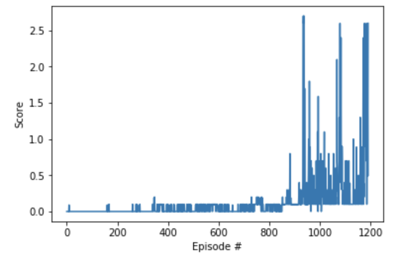

### Algorithm
Our solution is based on the DDPG algorithm as proposed by [[Lillicrap, Hunt, et. al.](http://arxiv.org/abs/1509.02971). DDPG is extends the [famous DQN algorithm](http://www.nature.com/articles/nature14236) s.t. it is able to train agents with continuous action spaces.
Compared to DQN, in DDPG an additional neural network (the actor) is introduced, which is trained to approximate the optimal policy directly. The Q-Network (the critic) still exists and serves as a judge to the actor. 

In order to speed up convergence we implemented two additions compared to the originally proposed implementation:
* Batch normalization as proposed in [Ioffe and Szegedy](http://arxiv.org/abs/1502.03167)
* Set local and target network weights to equal values at initialization (for both actor and critic)

In order to be able to use the algorithm in a multi agent setting (MADDPG - Multi Agent DDPG), we adapted the single agent DDPG version: Every agent receives its own (local) observation, but both agents share one actor network and one replay buffer. Both agents collaboratively learn to play tennis by competing in the game at the same time.

### Learning Curve

Score plot of our best attempt: An agent that solved the environment in 1092 episodes.  

The score (cumulated reward per episode) is increasing over time - the agents learns to play.

### Hyperparameters
We took a rather heuristic approach for finding the right configuration of our agent. The main ingredients of our model are:

 - Actor & Critic Networks: 2 hidden layers with (128,128) units each and relu activation (hidden units); batch normalization after the first hidden layer of the actor and the critic
 - BUFFER_SIZE = 1e6 (replay buffer size)
 - BATCH_SIZE = 128 (minibatch size)   
 - GAMMA = 0.99 (discount factor)
 - TAU = 1e-3 (for soft update of target parameters)
 - LR_ACTOR = 1e-3 (learning rate of the actor)
 - LR_CRITIC = 1e-3 (learning rate of the critic)
 - WEIGHT_DECAY = 0 (L2 weight decay)
 - max_t = 1000 (maximum number of timesteps per episode)
 - Exploratory Noise Parameters: mu=0, theta=0.15, sigma=0.1
 
 Expanding the buffer size and increasing the learning rate were the crucial steps to speed up convergence. Tuning the other parameters did not change convergence speed significantly. 

### Improvements / Ideas for Future Work
Further improvements could be:
 - Implement Prioritized Experience Replay
 - Do a more systematic hyperparameter search/tuning
 - Try solving other environments using a similar implementation (e.g. the Soccer environment)
 - Try using a [PPO algorithm](https://blog.openai.com/openai-baselines-ppo/) that was used to solve Dota2
